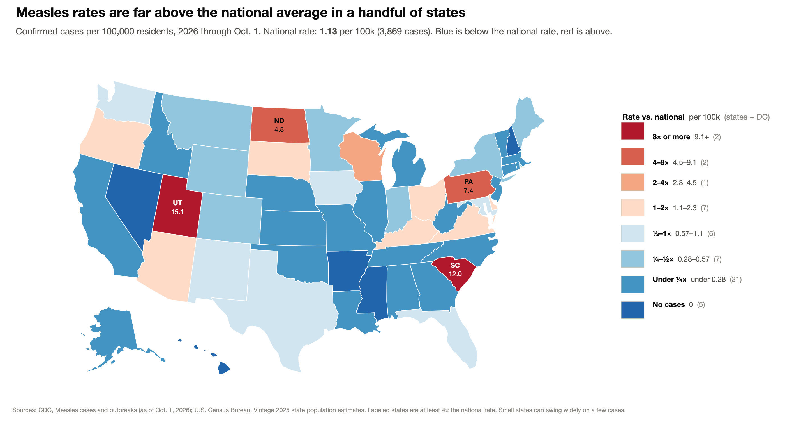

# Measles rates by state, 2026



Most news maps of the 2026 measles surge shade states by raw case counts, which mostly
reflects state population. This map shows **confirmed cases per 100,000 residents** and colors
each state relative to the **national rate** (1.13 per 100k): blues are below it, reds are above.

## Method

- **Cases:** CDC confirmed measles cases by jurisdiction, 2026 through Oct. 1
  (`data/MeaslesCasesMap.csv`, exported from CDC's measles cases map).
- **Population:** U.S. Census Bureau Vintage 2025 estimates for July 1, 2025
  (`data/census_state_pop_2025.csv`, produced by `fetch_population.py`).
- **National rate:** total cases ÷ total population of the 50 states plus DC
  (population-weighted, not an average of state rates).
- **Bins:** multiples of the national rate on a doubling scale: under ¼×, ¼–½×, ½–1×,
  1–2×, 2–4×, 4–8×, 8× or more. States with no cases get their own class. Each bin includes
  its lower bound, so a state at exactly the national rate would be red.
- **New York:** CDC reports New York City separately from the rest of New York State.
  The two are added together to match the Census statewide population.

Small states can move between bins on a handful of cases (Delaware's 23 cases give it 2.2 per 100k).

## Reproduce

From the repo root, after the setup in the [main README](../README.md):

```sh
.venv/bin/python 20261001-measles/fetch_population.py   # refresh Census populations (optional)
.venv/bin/python 20261001-measles/measles_rate_map.py   # print the rate table, write the PNG
```

## Sources

- CDC, [Measles Cases and Outbreaks](https://www.cdc.gov/measles/data-research/index.html), data as of Oct. 1, 2026
- U.S. Census Bureau, [State Population Totals, Vintage 2025](https://www2.census.gov/programs-surveys/popest/datasets/2020-2025/state/totals/)
